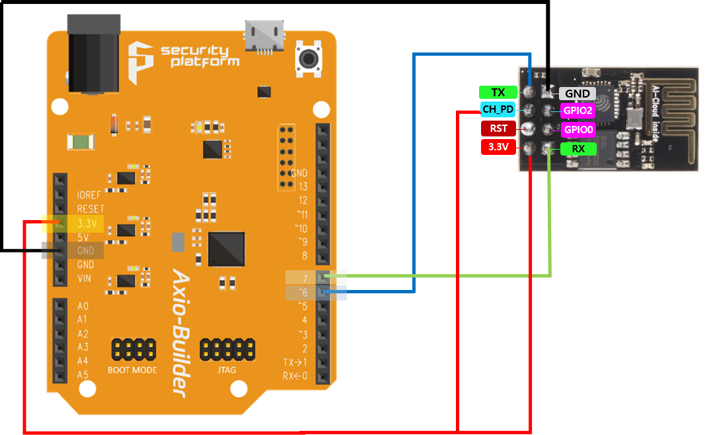

Axio-Builder Mbedtls Client with ESP8266
========================================

[*Fork from SparkFun ESP8266 WiFi Shield Library*](https://github.com/sparkfun/SparkFun_ESP8266_AT_Arduino_Library.git)

Documentation
-------------------
* This code has been tested with the [mbedtls](https://github.com/ARMmbed/mbedtls.git) using the ESP8266 module.

Prepare
-------------------
* The ESP-01 must be updated to firmware that supports AT command mode.
* Download [mbedtls](https://github.com/ARMmbed/mbedtls.git), compile, and run the 'programs/ssl/ssl_server2' .
* Connect ESP-01 to Axio-Builder with jumper wires as shown below.

